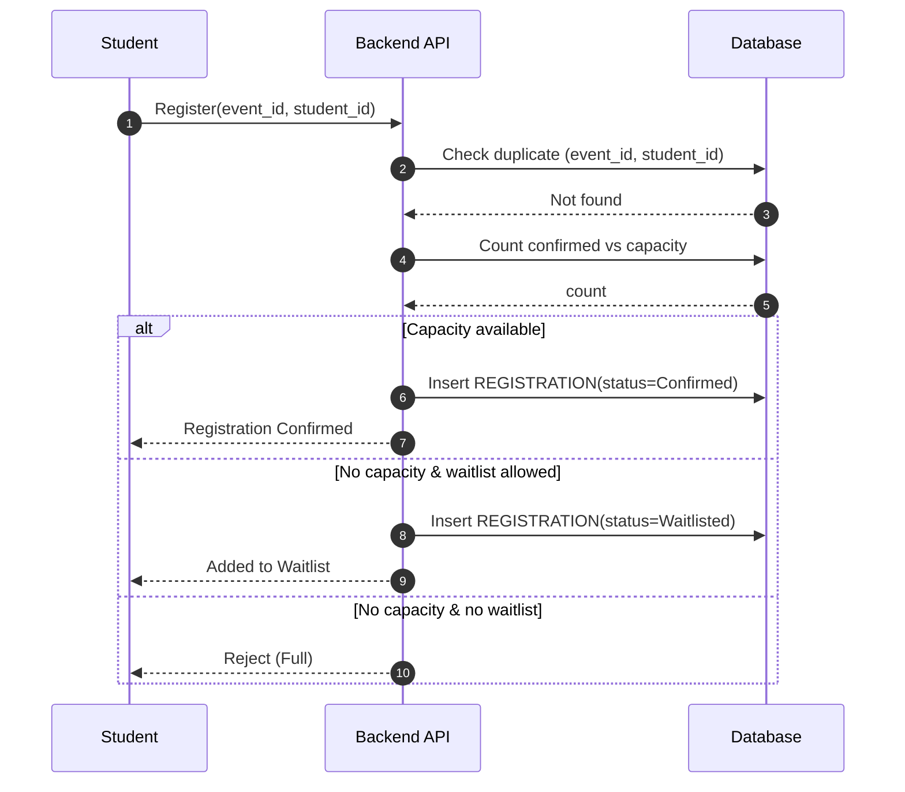
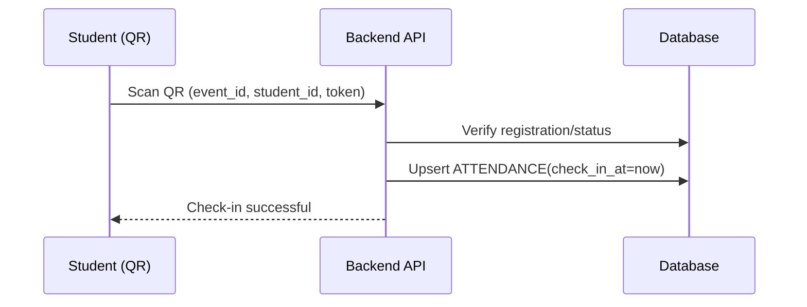
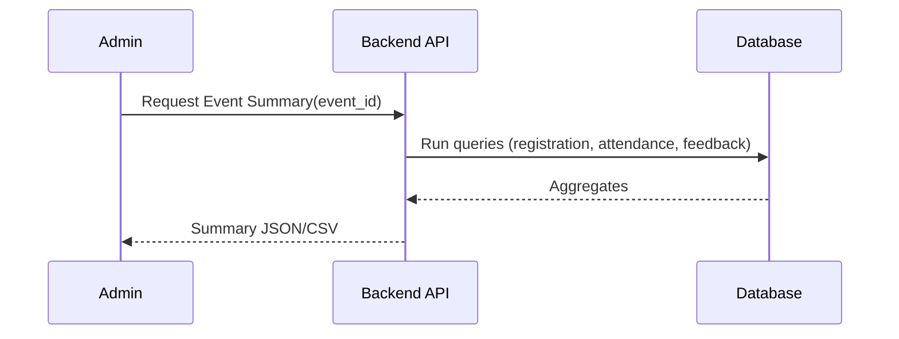

# Campus Event Management — Reporting Module (Design Document)

**Author:** <Your Name Here>  
**College:** <Your College>  
**Date:** 2025-09-07

---

## 1) Scope & Goals
Design a basic **event reporting module** for a campus event platform with:
- Admin portal for creating events.
- Student app to browse, register, and check-in.
- Reports: popularity, participation, attendance %, average feedback.

No coding is required; this document captures **data model, APIs, workflows, assumptions, and report queries**.

---

## 2) Data to Track
- **Event creation**: event metadata, type, timing, capacity, status.
- **Student registration**: registration status (confirmed/waitlisted/cancelled), timestamps.
- **Attendance**: check-in/out timestamps, method (QR/manual).
- **Feedback**: rating (1–5) + optional comment (only from attendees).

---

## 3) Multi‑Tenant Design & Scale Assumptions
**Scale**: ~50 colleges × ~500 students each × ~20 events/semester.  
**Tenancy**: Keep a **single logical database** with a `college_id` on tenant-bound tables, plus row-level constraints.  
**Event IDs**: Use **globally unique `event_id`** (UUID). Optionally also keep a human-friendly `event_code` unique per college: `UNIQUE(college_id, event_code)`.

**Why this design?**
- Simple operations across colleges if needed.
- Indexes on `(college_id, …)` keep queries fast.
- Easier governance than 50 separate databases; can be sharded later if required.

---

## 4) ER Diagram (Mermaid)
```mermaid
erDiagram
    COLLEGE ||--o{{ STUDENT : has
    COLLEGE ||--o{{ EVENT : organizes
    STUDENT ||--o{{ REGISTRATION : registers
    EVENT ||--o{{ REGISTRATION : has
    STUDENT ||--o{{ ATTENDANCE : checks_in
    EVENT ||--o{{ ATTENDANCE : records
    STUDENT ||--o{{ FEEDBACK : submits
    EVENT ||--o{{ FEEDBACK : receives

    COLLEGE {{
      string college_id PK
      string name
    }}

    STUDENT {{
      string student_id PK
      string college_id FK
      string roll_no
      string name
      string email
      string phone
      string branch
      int    year
      timestamp created_at
    }}

    EVENT {{
      string event_id PK
      string college_id FK
      string name
      string type  // Workshop|Hackathon|Seminar|Fest
      timestamp start_time
      timestamp end_time
      string location
      int capacity
      bool allow_waitlist
      string status // Draft|Open|Closed|Cancelled
      string created_by
      timestamp created_at
    }}

    REGISTRATION {{
      string reg_id PK
      string event_id FK
      string student_id FK
      timestamp registered_at
      string status // Confirmed|Waitlisted|Cancelled
      string source  // Web|Mobile
    }}

    ATTENDANCE {{
      string att_id PK
      string event_id FK
      string student_id FK
      timestamp check_in_at
      timestamp check_out_at
      string method // QR|Manual
      string marked_by
    }}

    FEEDBACK {{
      string feedback_id PK
      string event_id FK
      string student_id FK
      int rating // 1..5
      string comment
      timestamp submitted_at
    }}
```

---

## 5) Table Sketch & Key Constraints
- `UNIQUE(college_id, roll_no)` on **STUDENT** (no duplicate roll numbers inside a college).
- Prevent duplicate registrations: `UNIQUE(event_id, student_id)` on **REGISTRATION**.
- Feedback only once per student per event: `UNIQUE(event_id, student_id)` on **FEEDBACK**.
- Attendance records can be one per event per student: `UNIQUE(event_id, student_id)` on **ATTENDANCE** (or allow multiple with only last check-in counted).

**Capacity rule:** Confirmed registrations ≤ capacity; overflow → Waitlist if `allow_waitlist=true`.

---

## 6) API Design (No Coding — just specs)

### Event Management
- `POST /events` — Create an event (admin).
- `GET /events?college_id=...&type=...&status=...` — List/browse.
- `PATCH /events/{event_id}` — Update status: Draft/Open/Closed/Cancelled.

### Registration
- `POST /events/{event_id}/register` — Register a student.  
  - Reject if duplicate.  
  - Confirm if capacity available else Waitlist.  
- `DELETE /events/{event_id}/register/{student_id}` — Cancel registration (frees a seat; optionally auto-promote from waitlist).

### Attendance
- `POST /events/{event_id}/attendance/check-in` — Mark check-in (QR/manual).  
- `POST /events/{event_id}/attendance/check-out` — Optional.

### Feedback
- `POST /events/{event_id}/feedback` — Submit rating (1–5) + comment (**only if attended**).

### Reports
- `GET /reports/popularity?college_id=...` — Events sorted by registrations.  
- `GET /reports/participation?student_id=...` — Student’s attended events.  
- `GET /reports/event-summary?event_id=...` — Registrations, attendance %, average rating.  
- **Bonus**: `GET /reports/top-active-students?college_id=...&limit=3`  
- **Bonus**: `GET /reports/popularity?college_id=...&type=Workshop`

---

## 7) Core Workflows (Mermaid Sequence)

### 7.1 Registration


### 7.2 Attendance (QR)


### 7.3 Reporting


---

## 8) Edge Cases & Rules
- Duplicate registration attempts → reject politely.
- Cancelled events → registrations auto-cancel; attendance/feedback locked.
- Feedback only from attendees; one feedback per student/event.
- Attendance allowed only for **Confirmed** registrants.
- Waitlist auto-promotion when a seat frees.
- Time-window for check-in (e.g., within event hours).
- Email/phone uniqueness per student within a college.
- PII: restrict cross-college access using `college_id` filters.

---

## 9) Report Queries (SQL Sketch)

### 9.1 Event Popularity (by registrations)
```sql
SELECT e.event_id, e.name, e.type,
       COUNT(CASE WHEN r.status='Confirmed' THEN 1 END) AS registrations
FROM EVENT e
LEFT JOIN REGISTRATION r ON r.event_id = e.event_id
WHERE e.college_id = :college_id
GROUP BY e.event_id, e.name, e.type
ORDER BY registrations DESC;
```

### 9.2 Attendance % per event
```sql
SELECT e.event_id, e.name,
       CAST(100.0 * COUNT(DISTINCT a.student_id) / NULLIF(COUNT(DISTINCT r.student_id),0) AS DECIMAL(5,2)) AS attendance_pct
FROM EVENT e
LEFT JOIN REGISTRATION r ON r.event_id = e.event_id AND r.status='Confirmed'
LEFT JOIN ATTENDANCE a ON a.event_id = e.event_id
WHERE e.college_id = :college_id
GROUP BY e.event_id, e.name
ORDER BY attendance_pct DESC;
```

### 9.3 Average Feedback per event
```sql
SELECT e.event_id, e.name,
       AVG(f.rating) AS avg_rating, COUNT(f.rating) AS ratings_count
FROM EVENT e
LEFT JOIN FEEDBACK f ON f.event_id = e.event_id
WHERE e.college_id = :college_id
GROUP BY e.event_id, e.name
ORDER BY avg_rating DESC NULLS LAST;
```

### 9.4 Student Participation (events attended)
```sql
SELECT s.student_id, s.name,
       COUNT(DISTINCT a.event_id) AS events_attended
FROM STUDENT s
LEFT JOIN ATTENDANCE a ON a.student_id = s.student_id
WHERE s.college_id = :college_id
GROUP BY s.student_id, s.name
ORDER BY events_attended DESC;
```

### 9.5 Top N Most Active Students (attended)
```sql
SELECT s.student_id, s.name,
       COUNT(DISTINCT a.event_id) AS events_attended
FROM STUDENT s
JOIN ATTENDANCE a ON a.student_id = s.student_id
WHERE s.college_id = :college_id
GROUP BY s.student_id, s.name
ORDER BY events_attended DESC
LIMIT :limit; -- e.g., 3
```

### 9.6 Filter by Event Type
```sql
-- Combine with 9.1 and add:
AND e.type = :type
```

---

## 10) Non‑Functional Notes (Brief)
- **Indices**: `(college_id, event_id)`, `(college_id, roll_no)`, `(event_id, student_id)`.
- **Privacy**: enforce row-level filters by `college_id` in all admin queries.
- **Portability**: SQL is SQLite/Postgres friendly with minor syntax tweaks.
- **Extensibility**: add `ORGANIZER` table later if needed.

---

## 11) Appendix — Status Codes
- Event.status: Draft | Open | Closed | Cancelled
- Registration.status: Confirmed | Waitlisted | Cancelled
- Attendance.method: QR | Manual
```

